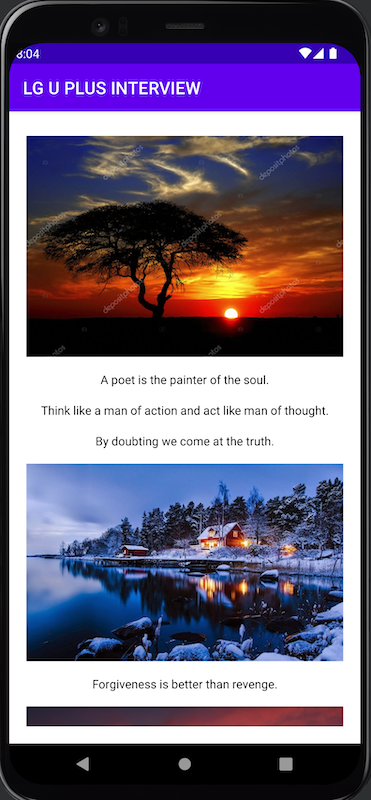

# 아이들나라 Android Live coding test

## 주의 사항

- 본 예제 소스의 외부 유출을 금합니다.

## 수행 방법

- 면접 15분전에 소스를 다운로드 합니다.
- 안드로이드 스튜디오(Artic Fox 7.0 이상)에서 다운로드 받은 소스를 임포트합니다.
- Virtual Device(ex: Pixel 4 API 33)를 생성하여 Run시 VD상에서 MainActivity 실행되는 환경을 구성합니다.
- 면접 시작 시 면접관의 안내에 따라 전체 화면 공유와 함께 라이브코딩을 진행합니다.
- 제한시간은 40분이며 면접관이 시간 경과를 안내합니다.
- Google, Android developer site 등 인터넷 검색 사용이 가능합니다.
- 정답보다는 문제를 해결해 나가는 과정에 초점을 맞추고 있습니다.

## 문제 소개

### 1. Recycler view or Compose를 이용하여 assets에 포함되어 있는 이미지와 텍스트를 표시하세요.

* 데이터는 DataLoader class의 loadTextList(), loadImageList()를 통해 얻을 수 있습니다.
* Recycler view or Compose를 이용하는 것 외에 다른 기술 제약은 없으며, 필요 시 Jetpack, 3rd party library를 추가할 수 있습니다.

> 샘플 화면

